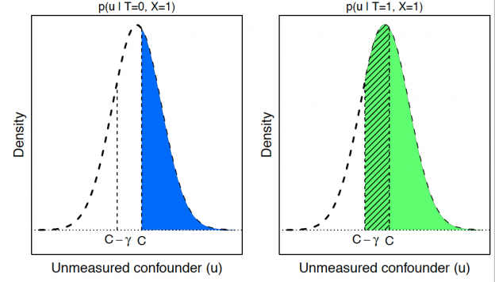

<section>
	<h4> How conditioning on post-treatment variables can ruin your experiment and what to do about it</h4>
	<h5> with Jacob M. Montgomery and Brendan Nyhan</h5>
	

	

	

	

	In principle, experiments offer a straightforward method for social scientists to accurately estimate causal effects. However, scholars often unwittingly distort treatment effect estimates by conditioning on variables that could be affected by their experimental manipulation. Typical examples include controlling for post-treatment variables in statistical models or eliminating observations based on post-treatment criteria. Though these modeling choices are intended to address common problems encountered when conducting experiments, they can create severe bias in estimates of causal effects. Moreover, problems associated with conditioning on post-treatment variables remain largely unrecognized in the field, which frequently publishes studies using these practices in our discipline's most prestigious journals. We demonstrate the magnitude of the potential distortions induced by post-treatment conditioning in experiments using Monte Carlo simulations and a reanalysis of real-world data before concluding with recommendations for best practice.

	

	

	
	

	

	

	
	
	
Vestibulum ultrices risus velit, sit amet blandit massa auctor sit amet. Sed eu lectus sem. Phasellus in odio at ipsum porttitor mollis id vel diam. Praesent sit amet posuere risus, eu faucibus lectus. Vivamus ex ligula, tempus pulvinar ipsum in, auctor porta quam. Proin nec dui cursus, posuere dui eget interdum. Fusce lectus magna, sagittis at facilisis vitae, pellentesque at etiam. Quisque posuere leo quis sem commodo, vel scelerisque nisi scelerisque. Suspendisse id quam vel tortor tincidunt suscipit. Nullam auctor orci eu dolor consectetur, interdum ullamcorper ante tincidunt. Mauris felis nec felis elementum varius. Nam sapien ante, varius in pulvinar vitae, rhoncus id massa. Donec varius ex in mauris ornare, eget euismod urna egestas. Etiam lacinia tempor ipsum, sodales porttitor justo. Aliquam dolor quam, semper in tortor eu, volutpat efficitur quam. Fusce nec fermentum nisl. Aenean erat diam, tempus aliquet erat. Etiam iaculis nulla ipsum, et pharetra libero rhoncus ut. Phasellus rutrum cursus velit, eget condimentum nunc blandit vel. In at pulvinar lectus. Morbi diam ante, vulputate et imperdiet eget, fermentum non dolor. Ut eleifend sagittis tincidunt. Sed viverra commodo mi, ac rhoncus justo. Duis neque ligula, elementum ut enim vel, posuere finibus justo. Vivamus facilisis maximus nibh quis pulvinar. Quisque hendrerit in ipsum id tellus facilisis fermentum. Proin mauris dui.

</section>
